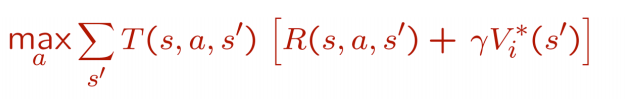

# 值迭代 value iteration
> 这篇文章就是在讲一张图

值迭代（Value Iteration）是一种精确求解马尔可夫决策过程（ Markov Decision Process，MDP）的策略
与值函数的一种方法。这里的“值”就是值函数啦，直观讲值函数是一个状态的函数，衡量状态的价值。                                  
值迭代算法通过不断迭代更新当前值函数的值直到收敛到真实值函数的值。当前状态的值$V_i(s)$是经过i步行动后
所可能得到的最大期望回报。其中回报是当前状态s，采取的行动a，和转移到的状态s'的3元函数，是指从采取行动a从当前状态
s转移到状态s'的回报。之所以是3元函数是因为马尔可夫决策过程是一个概率模型，即使给定当前状态与当前行动，也不能
确定到底会转到哪一个状态，而只能知道转移到各个可能状态的概率。也就是说，给定当前状态与当前行动，转移到的状态
是一个符合某种分布的随机变量。

有了上面的说明，根据定义就可以知道$V_1(s)$表示1步行动后可能得到的最大期望回报。我们知道从当前状态s采取a行动期望回报就是转移到各个状态的概率乘以转移到那个状态s'后的回报然后对所有可能转移到的状态求和。也就是下图和式的第一部分，T就是转移概率，R为回报（精确的说是从状态s经过行动a转移到s'的概率与回报）。以上我们只是计算了在行动a下的一步期望回报，进一步转移的最大期望回报就是所有行动回报的最大值。

当知道了i步行动在所有状态s下获得期望回报的最大值后我们怎样将眼光放长远一丢丢，算i+1步呢？

答案就是分解动作将其分解为1+i步，i步是我们已知的，一步转移也是我们分析过的。图上两部分用大白话说就是从s经过i+1步所获回报就是先走一步到s'的回报加上从s'走i步的回报，因为求期望回报所以外面乘以转移到各个状态的概率。类似，在所有行动上求最大值。
> 伽马是折扣率，一般是（0，1]之间的数，就是说同样的回报，现在得到比未来得到更有价值

通过一推二，二推三，一直推到值函数收敛（就是i+1与i步结果相近）我们知道了每个状态的价值，但我们往往还想知道在某个状态下，我们该采取什么行动，也就是知道策略函数（从状态到行动的一个函数）

策略函数可以在求值函数的过程中顺便求出，一句话，值函数在迭代的每一步取最大值，策略函数取使值函数取到最大值的行动。

详细讲解见课程[CS287](https://people.eecs.berkeley.edu/~pabbeel/cs287-fa13/slides/mdps-exact-methods.pdf)ppt,
以及Matlab[代码](https://github.com/keyianpai/starter_PS1-v3/blob/master/starter_Q2-3_value_iteration-LP/value_iteration.m)实现